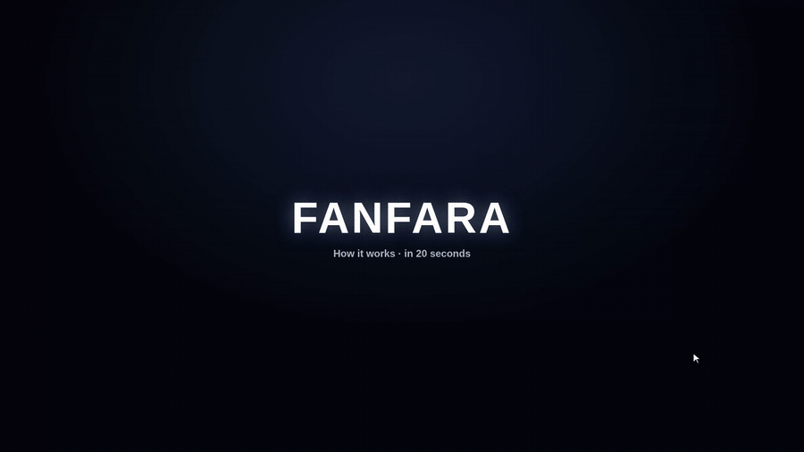

# 🎉 Fanfara

<p align="center">
  
</p>

[🇬🇧 Read in English](README.md) · **🇮🇹 Italiano**

**Rendi lo sblocco degli achievement di Steam spettacolare come su Xbox e PlayStation.**

Su Steam, quando sblocchi un achievement compare una piccola notifica anonima nell'angolo. Fanfara
la sostituisce con una notifica animata e festosa, in cui **stile, icona e suono cambiano in base
alla rarità** dell'achievement: più è raro (meno giocatori al mondo l'hanno ottenuto), più lo
sblocco è epico.

È un **overlay nativo e leggero per Windows**: non rallenta il PC e non richiede ore di
configurazione. Avvialo, gioca, e pensa a tutto lui.

---

## ⬇️ Scarica e usa (per tutti)

1. Vai nella sezione **[Releases](../../releases)** qui su GitHub.
2. Scarica l'ultima versione:
   - **`FanfaraSetup.exe`** — l'installer (consigliato): installa tutto e tiene l'app
     **aggiornata in automatico**.
   - oppure **`Fanfara.zip`** — la versione portable: estraila e avvia `Fanfara.exe`, niente da installare.
3. Avvialo.

Nient'altro da installare: niente .NET, niente terminale. È tutto incluso.

> ⚠️ **La prima volta**, Windows potrebbe mostrare l'avviso blu "Windows ha protetto il PC". È
> normale per le app gratuite non firmate con un certificato a pagamento.
> Clicca **"Ulteriori informazioni"** → **"Esegui comunque"**.

Al primo avvio si apre la finestra **Impostazioni**: scegli uno stile, la posizione sullo schermo e
la durata, e provali subito con il pulsante **Prova**. Ogni stile ha già il suo suono — niente altro
da configurare. Dopo averla chiusa, Fanfara resta attiva con un'icona vicino all'orologio (in basso
a destra): cliccala per riaprire le impostazioni o uscire.

Poi avvia Steam, gioca, e la fanfara comparirà al primo achievement sbloccato. 🎮

### Consiglio: disattiva la notifica di Steam
Per evitare i doppioni, puoi disattivare quella predefinita di Steam:
**Steam → Impostazioni → Nel gioco** (o **Notifiche**) → disattiva la notifica di sblocco achievement.

---

## ✨ Cosa include

- **46 stili di notifica**, organizzati in **7 schede**:
  **Base · Console · Capcom · Square-Enix · Microsoft · Ubisoft · CD Projekt**.
- Ogni stile ha un **box unico**, un'**icona diversa per ogni rarità** e un **suono integrato** —
  tutto **in 3D e animato**. (Niente selettore separato del suono: il suono fa parte dello stile.)
- **10 stili Base originali e astratti**: Onda, Pulsar, Mosaico, Numero, Carica, Coriandoli, Nebula,
  Tratto, Piega, Orbita.
- Pacchetti ispirati ai giochi con **emblemi e suoni originali** (nessun logo o audio ufficiale):
  Capcom, Square-Enix, Microsoft/Xbox, Ubisoft, CD Projekt (The Witcher, Cyberpunk 2077…).
- **5 rarità** che cambiano icona, colore, intensità ed effetti — Comune, Non comune, Raro, Epico,
  Leggendario — e il **Leggendario ha sempre qualcosa in più** ✨.
- **5 lingue** — Italiano, Inglese, Francese, Tedesco e Spagnolo. L'app segue in automatico la
  lingua di Windows, oppure puoi sceglierla nelle Impostazioni; **è tutto tradotto**, fino alla
  scala dei ranghi a tema di ogni stile. Anche l'installer segue la lingua del sistema.
- **7 posizioni** sullo schermo, durata regolabile, **tema chiaro/scuro**, **avvio con Windows** e
  **aggiornamenti automatici**.
- **Funziona anche nei giochi a schermo intero e senza bordi** — Fanfara prepara da sola i tuoi giochi Steam perché le notifiche compaiano in gioco, senza configurazione.
- Notifiche **grandi e leggibili**, perfette su monitor ampi e ad alta risoluzione.

---

## 🛠️ Per sviluppatori (compilalo da solo)

Ti serve solo il **.NET 8 SDK** (gratis): https://dotnet.microsoft.com/download

Nella cartella `src/`:

```bat
dotnet run
```

per avviarlo in sviluppo, oppure per creare il pacchetto distribuibile:

```bat
dotnet publish -c Release
```

L'app finita è *self-contained* (include il runtime .NET), quindi la cartella è autonoma e portabile
su qualunque PC Windows.

> L'app deve girare **sul PC dove gira Steam**. Fanfara comunica con il gioco in esecuzione tramite
> l'API Steamworks come se fosse quel gioco (senza chiave API).

### Pubblicare una nuova versione
Il repo include `.github/workflows/build.yml`. Quando pubblichi una **Release** con un **tag** che
inizia con `v` (es. `v0.1.12`), GitHub compila l'app sui propri server Windows e allega
automaticamente `Fanfara.zip` **e** `FanfaraSetup.exe` alla Release. Nessuna compilazione manuale.

---

## ⚙️ Come funziona (in breve)

- `SteamWatcher.cs` — il supervisore. Avvia un **processo Steam separato** per il gioco in
  esecuzione, così l'app principale non carica mai Steam direttamente (questo mantiene Fanfara
  stabile ed evita che il gioco risulti "ancora in esecuzione" dopo che esci).
- `SteamWorker.cs` — il processo figlio. Inizializza l'API Steamworks **come il gioco in
  esecuzione**, controlla ogni secondo se è stato sbloccato un nuovo achievement (leggendo la
  percentuale di rarità mondiale) e rileva quando il gioco si chiude. Comunica gli sblocchi all'app.
- `OverlayWindow` — una finestra trasparente, sempre in primo piano e *click-through*, che copre lo
  schermo e ospita una WebView2.
- `web/notify.html` — la grafica delle notifiche: 46 stili che disegnano lo sblocco con il box,
  l'icona e il suono giusti; la rarità decide colori ed effetti.
- `web/settings.html` — la finestra delle Impostazioni (con barra del titolo a tema).
- `Updater.cs` — controlla su GitHub se c'è una Release più recente e aggiorna da solo.
- `StartupManager.cs` — avvio con Windows (opzionale). `config.json` — le preferenze, accanto all'exe.

### Note oneste
- L'overlay compare sui giochi in modalità **finestra senza bordi** (lo standard di oggi). Solo nel
  vero *fullscreen esclusivo* potrebbe non apparire — lo stesso limite di ogni overlay simile.
- I giochi che usano la **Frame Generation** o il **fullscreen esclusivo** possono nascondere qualsiasi overlay esterno. Attiva l'opzione avanzata **“Compatibilità con Frame Generation”** nelle Impostazioni (richiede permessi admin e un riavvio una tantum) per vedere le notifiche anche lì.
- I suoni sono **sintetizzati dal vivo** dentro ogni stile: ne definiscono il carattere e potranno
  essere sostituiti con campioni audio registrati in futuro.

> ℹ️ Progetto amatoriale, non affiliato né approvato dalle case produttrici. Tutti i marchi
> appartengono ai rispettivi proprietari.

## Licenza
MIT — vedi `LICENSE`. Libero di usare, modificare e condividere.
